<center>
    <H1>
        GUIslice Builder
    </H1>
    <H2>
        User Guide
    </H2>
    <H3>
        Ver: 0.11.0-rc1
    </H3>
</center>


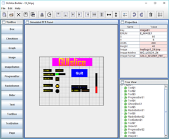


**Publication date and software version**

Published february, 2019. Based on GUIslice API Library 0.11.0

**Copyright**

This document is Copyright © 2019,2018 by Paul Conti. You may distribute or modify it under the terms of the MIT License.  https://opensource.org/licenses/MIT

All trademarks within this guide belong to their legitimate owners.


---------
<div style="page-break-after: always;"></div>

# 1.0  Introduction

GUIslice library is a lightweight platform-independent GUI designed for embedded displays.  While it can support other systems it started with support for  use with Raspberry Pi and Arduino.  It's written and supported by Calvin Hass.  You can download the library and example files from github.  See the wiki pages 

- https://github.com/ImpulseAdventure/GUIslice/wiki

for more details.

It's a nice package but the embedded design choice to eliminate dynamic memory allocation does mean additional care must be taken in the user code to manage the data structures.

The GUIslice Builder creates a cross-platform desktop application that automates some of the boilerplate code generation and tracking of the UI pieces. For example, the Builder helps manage:
- Defines, enums, UI storage declarations
- Coordinates and dimensions of UI elements could be visually created
- Colors and fonts could also be modeled within the Builder

The net result is that the Builder allows users to layout their UI visually and enables boilerplate GUI code to be generated quickly with a drag-and-drop desktop application and save the user from some of the bookkeeping and potential errors that might otherwise come up.

It and generate a skeleton C file for the target platform, either Arduino, Arduino min (using flash storage), or linux.

An important design goal was to allow for incremental (round-trip) revisions between user code updates and Builder visual element adjustments.


You will notice in the generated C code various tags inserted by the builder such as:

//<InitGUI !Start!>

//<InitGUI !End!>

As long as you refrain from adding or modifying code between these autogenerated tags you can continue to add additional widgets to your project and not lose any other edits you make.   The only exception is the button callbacks where the builder will test for existing ENUMs and not delete any code.

//<Button Enums !Start!>

//<Button Enums !End!> 

The code you add between these tags will be kept safe.

---------------
<div style="page-break-after: always;"></div>

# 2.0  Getting Started

See the Builder's wiki for installation instructions:

- https://github.com/ImpulseAdventure/GUIslice/wiki/GUIslice-Builder

##  2.1 Builder Screen Layout

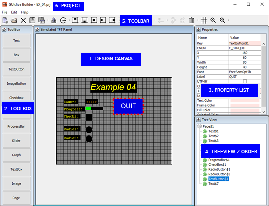

1. Design Canvas is where to create your UI.

2. Toolbox is where you select the UI Widget to drop on the design canvas.

3. Property List allows you to view and change various properties of the selected Widget.

4. Treeview displays all widgets you have selected in z-order of display.

5. Toolbar list icon buttons for file handling and widget management.

6.  Displays the current project name.

NOTE:  The grid color and lines can be changed. The grid turned off/on and snapTo grid can also be turned off/on. You can preview your UI by pressing the Toolbar Grid button to toggle the grid lines on/off.

-----------
<div style="page-break-after: always;"></div>

## 2.2 Setting Screen parameters

The builder is initially setup for Adafruit's TFT 2.8 Display.  It's display is 320px wide and 240px height with a DPI of about 144.   (I know the docs say 141 but I go with what works).

You must setup the builder for your target screen's width and height; if its different than the default.  I have tested the DPI of 144 on various screens up to 3.5 inches and my default of 144 seems to work just fine.  You can change it if needed.   It's purpose is to allow the builder to show users the fonts correctly scaled in the design canvas and to correctly size the text bounding rectangle for the target platform.

using your mouse select edit->options

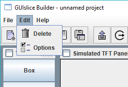

Then set your target platform, your display's width and height, and point the project directory to where you will be storing output files.   The directory must already exist. For Arduino users I suggest pointing to your sketchbook folder.


-----------------------------------------------
<div style="page-break-after: always;"></div>

## 2.3 Creating your UI

Now that you have your builder setup you can start creating your UI.  

Before beginning lets go over over the mouse selecting rules for the design canvas:

- A Left-click on an object deselects any existing selection and selects the object.
- A Control Left-click on an object toggles its selection without affecting the selection of any other objects.
- A Shift Left-click on an object selects it without deselecting any other objects.
- Pressing down the left mouse button and dragging the rubber band rectangle over the a group of objects will select them all. For Example:
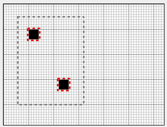

Now start by picking your first UI piece on the Toolbox. I suggest you not start with a box that takes up your whole screen or the grid lines will be useless.  Besides setting the background color has the same effect without interfering with UI design.  If you want a preview of the UI without grid lines simply use the toolbar Grid button to toggle the grid on/off.

Say you start with a Text Button, you will notice its been randomly placed on the canvas.  Using your mouse select this Text Button by moving the mouse pointer over the Text Button and clicking the left key.  It will now have a dashed red rectangle around it to indicate its been selected.  Now press and hold the mouse left key and drag the Button approximately where you want it. You can refer to the Using Toolbar section for using the various toolbar buttons for further alignment.   

Off to the  top->right of the screen you will see all of the properties for this widget.  Anything with a rose color is something you can't edit.  When you were dragging your button you might have noticed the x and y coordinates changing dynamically.  Then when you released the mouse a slight jump occurred snapping the UI Button to the grid's snapTo points.  Instead of dragging the Text Button around you could also have simply typed in the new x and y positions within the properties table.

One thing you should consider as you add UI widgets is changing the ENUM names for Button and any other widget you might need to access at runtime.  It will make your life a lot easier if they have meaningful names.  For example, this new Text Button might be your QUIT button.  So change the ENUM from its default to E_BTNQUIT, while also changing Text to Quit.  IMHO, Text Buttons also look better with a larger font, say FreeSansBold9pt7b. 

-----------------------------------------------
<div style="page-break-after: always;"></div>

# 3.0 Using Toolbar

## 3.1 File buttons

At the far left hand side of the toolbar are our file buttons.


This is the new projects button.


The open existing project button.


The close current project button.


The save current project button.


The save current project under a different name button.

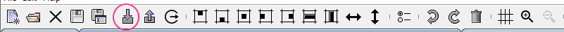

The import an existing GUIslice pre-builder .ino or .c file. See Section 5 for more details.


The export the generate code skeleton for the current project button.


Exit builder button.

-----------------------------------------------
<div style="page-break-after: always;"></div>

## 3.2 Miscellaneous buttons

At the far right hand side of the toolbar are some miscellaneous buttons.


The first is the RadioButton grouping icon. It allows you to select a group of radio buttons or check boxes and group them so that only one may be turned on while the others will be automatically turned off. 


Next is the undo button which will recover from any recent changes.


The redo button will allow a replay of your previous undo(s).


The delete button allows removal of a widget.  You can only select a page for deletion by selecting it inside the treeview.  You must, however, have removed all widgets from the page before attempting a deletion.  Furthermore you are never allowed to delete the first or main page.


The grid button allows you to turn on/off the grid.  The snapTo is also turned off with the grid. If you want the grid or snapTo turned on/off indepenent of each other you must use the edit->options->Grid tab.

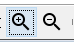

The Zoom buttons let you enlarge or reduce your veiw of the design canvas.

-----------------------------------------------
<div style="page-break-after: always;"></div>

## 3.3 Align Top
The easiest way I can think of to show how to use the alignment buttons is with a couple of checkboxes.  Go ahead and create two boxes it doesn't matter where they end up on the design canvas.


Now press the Align Top button.


This gives you:

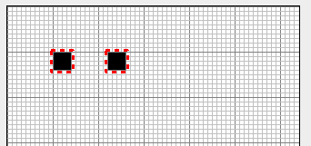

If you press it a second time the widgets move to the top margin (set as a default of 5).  You can change the size of margins in the General tab. You can press the UNDO button to get back to the original position and test the other alignment buttons.

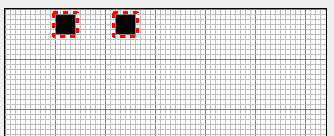

-----------------------------------------------
<div style="page-break-after: always;"></div>
## 3.4 Align Bottom
Before:


Now press the Align Bottom button.


This gives you:

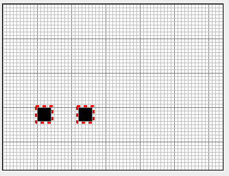

If you press it a second time the widgets move to the bottom margin.

-----------------------------------------------
<div style="page-break-after: always;"></div>

## 3.5 Align Center

You can only center one widget at a time.

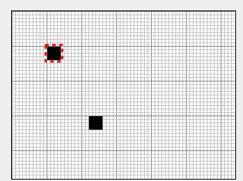

Now press the Align Center button.


This gives you:

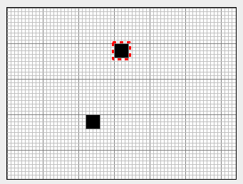


-----------------------------------------------
<div style="page-break-after: always;"></div>

## 3.6 Align Left

Before:


Now press the Align Left button.


This gives you:

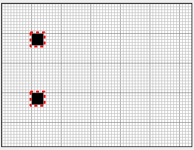

If you press it a second time the widgets move to the left margin.

-----------------------------------------------
<div style="page-break-after: always;"></div>

## 3.7 Align Right

Before:


Now press the Align Right button.


This gives you:

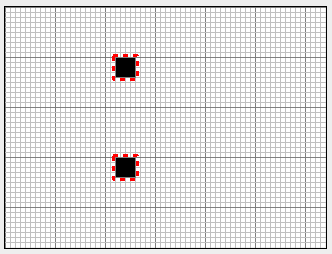

If you press it a second time the widgets move to the right margin.

-----------------------------------------------
<div style="page-break-after: always;"></div>

## 3.8 Align Horizontal Spacing

Before:

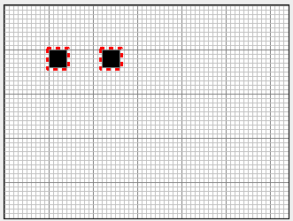

Now press the Align Horizontal Spacing button.


With:

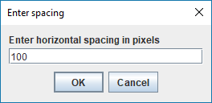

This gives you:

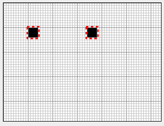

-----------------------------------------------
<div style="page-break-after: always;"></div>

## 3.9 Align Vertical Spacing

Before:

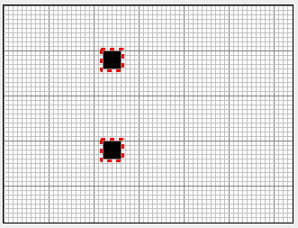

Now press the Align Vertical Spacing button.


With:

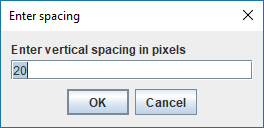

This gives you:

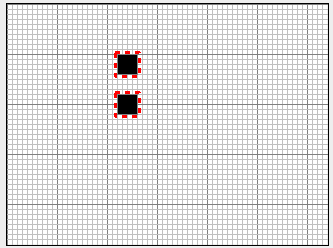

-----------------------------------------------
<div style="page-break-after: always;"></div>

## 3.10 Align Width

Before:


Now press the Align Width button.


This gives you:

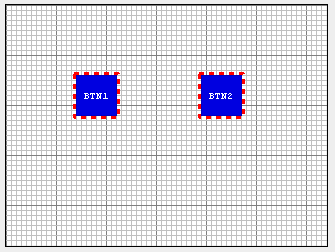

-----------------------------------------------
<div style="page-break-after: always;"></div>

## 3.11 Align Height

Before:

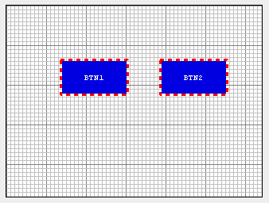

Now press the Align Height button.


This gives you:

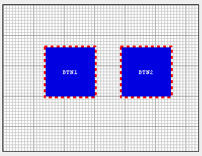

-----------------------------------------------
<div style="page-break-after: always;"></div>

# 4.0 Widgets
This section outlines the various properties you can set and their useage for each type of widget. Images are discussed in section 5.4.
## 4.1 Common Properties
These are the basic common properties for all widgets with the exception of Page.
| NAME   | VALUE                                |
|--------|--------------------------------------|
| Key    | Used Internally as an index key      |
| Enum   | Used by GUIslice API as a identifier |
| X      | The widget’s  X Coordinate           |
| Y      | The widget’s  X Coordinate           |
| Width  | The widget’s width in pixels         |
| Height | The widget’s height in pixels        |

Most also have the Default colors option along with a set new colors you can set.
| NAME                | VALUE                                    |
|---------------------|------------------------------------------|
| Use Default Colors? | If checked, Use the default color scheme |
| Frame Color         | Override Frame color with this color     |
| Fill Color          | Override Fill color with this color      |
| Selected Color      | Override Selected color with this color  |

## 4.2 Box
| NAME          | VALUE                                        |
|---------------|----------------------------------------------|
| Draw Function | If checked, Creates a CbDrawScanner callback |
| Tick Function | If checked, Creates a CbTickScanner callback |

-----------------------------------------------
<div style="page-break-after: always;"></div>

## 4.3 Check Box
| NAME             | VALUE                                               |
|------------------|-----------------------------------------------------|
| Checked?         | If checked, set the initial state as ‘checked’      |
| Check Mark Color | Determines the color of check mark                  |
| Group ID         | Groups checkboxes together. Allows only one checked |

## 4.4 Graph
| NAME           | VALUE                                             |
|----------------|---------------------------------------------------|
| Font           | Font ID to use for graph area                     |
| Maximum Points | Maximum number of points in buffer                |
| Graph Style    | Style of Graph: Dot, or Fill. Line not supported. |
| Color of Graph | Set color of graph dots or fill.                  |

-----------------------------------------------
<div style="page-break-after: always;"></div>

## 4.5 Progress Bar

| NAME                  | VALUE                                          |
|-----------------------|------------------------------------------------|
| Vertical?             | Checked is vertical bar,  horizontal otherwise |
| Guage Style           | Bar, Radial or Ramp style                      |
| Minimum Value         | Integer value from 0 to N                      |
| Maximum Value         | Integer value from 0 to N                      |
| Starting Value        | Integer value from 0 to N                      |
| Gauge Indicator Color | Sets color of gauge indicator                  |

The following only applies to Radial Style.

| NAME                  | VALUE                                          |
|-----------------------|------------------------------------------------|
| Tick Divisions	      | Default 8                                      |
| Tick Size	            | Default 5                                      |
| Tick Color	          | Default GRAY                                   |
| Indicator Length	    | Default 10                                     |
| Indicator Tipe Size   | Default 3                                      |
| Indicator File?	      | Default false                                  |


You must have the following set inside your GUIslice_config_<ard,linux>.h file:
if you use Ramp Style:
```
#define GSLC_FEATURE_XGAUGE_RAMP    1
```
if you use Radial Style:
```
#define GSLC_FEATURE_XGAUGE_RADIAL    1
```

-----------------------------------------------
<div style="page-break-after: always;"></div>

## 4.6 Radio Button
| NAME             | VALUE                                                 |
|------------------|-------------------------------------------------------|
| Checked?         | If checked, set the initial state as ‘checked’        |
| Check Mark Color | Determines the color of check mark                    |
| Group ID         | Groups radiobuttons together. Allows only one checked |

## 4.7 Slider
| NAME           | VALUE                                             |
|----------------|---------------------------------------------------|
| Minimum Value  | Integer value from 0 to N                         |
| Maximum Value  | Integer value from 0 to N                         |
| Starting Value | Integer value from 0 to N                         |
| Thumb Size     | Size of thumb in pixels                           |
| Vertical?      | Checked is vertical slider,  horizontal otherwise |
| Tick Divisions | Integer number of divisions, from 0 to N          |
| Tick Size      | Size of tick line in pixels                       |
| Trim Style?    | Makes the line thicker                            |
| Trim Color     | Sets color of the slider                          |

-----------------------------------------------
<div style="page-break-after: always;"></div>

## 4.8 Text
| NAME                   | VALUE                                          |
|------------------------|------------------------------------------------|
| Font                   | Name of your chosen font                       |
| Text                   | The text to display                            |
| UTF-8?                 | Only 7 bit ascii characters unless checked.    |
| Fill Enabled?          | Uncheck to disable on slow displays            |
| External Storage Size  | 0 unless runtime access needed                 |
| ElementRef             | Only set if storage >0. Allows runtime access. |
| Text Alignment         | Can be Left, Center, or Right.                 |

NOTE: Text Alignment can only be used if you have set external storage size greater then 0.  Text Literals are set to exact size so no alignment would be detectable.
You should also realize that any text used with external storage is ignored at runtime since the whole point is that its text you set at runtime for display of any sensor data or whatever feedback you are giving users.

## 4.9 Text Box
| NAME         | VALUE                                        |
|--------------|----------------------------------------------|
| Font         | Name of your chosen font                     |
| Wrap Text    | Checked if you text to wrap across lines     |
| Text Rows    | Integer number of text rows                  |
| Text Columns | Integer number of text characters on a line. |

NOTE: Text rows and columns are only an approximation.  Embedding colors will require extra space. See the GUIslice API for further details.

You must have the following set inside your GUIslice_config_<ard,linux>.h file:
```
#define GSLC_FEATURE_XTEXTBOX_EMBED    1
```

-----------------------------------------------
<div style="page-break-after: always;"></div>

## 4.10 Text Button
| NAME               | VALUE                                           |
|--------------------|-------------------------------------------------|
| Font               | Name of your chosen font                        |
| Button Label       | Text label to show within the button.           |
| UTF-8?             | Only 7 bit ascii characters unless checked.     |
| Change Page Funct? | If checked create a jump to new page callback   |
| Page Enum          | The new page the callback will use in the jump. |

## 4.11 Image 
| NAME               | VALUE                                           |
|--------------------|-------------------------------------------------|
| Image              | File Name holding normally shown image          |
| Image defines	     | pound define of image, can be renamed           |
| Image Format	     | GSLC_IMGREF_<FMT_BMP16, FMT_BMP24, FMT_RAW>     |
| Transparent?       | If true, support for transparency provided      |
| Change Page Funct? | If checked create a jump to new page callback   |
| Page Enum          | The new page the callback will use in the jump. |

## 4.12 Image Button
| NAME                | VALUE                                               |
|---------------------|-----------------------------------------------------|
| Image               | File Name holding normally shown image              |
| Image When Selecte d| File Name holding glow or selected image            |
| Image defines	      | pound define of image, can be renamed               |
| Select Image defines| pound define of image when selected, can be renamed |
| Image Format	      | GSLC_IMGREF_<FMT_BMP16, FMT_BMP24, FMT_RAW>         |
| Transparent ?       | If true, support for transparency provided          |
| Change Page Funct?  | If checked create a jump to new page callback       |
| Page Enum           | The new page the callback will use in the jump.     |

## 4.13 Page
This is the container for widgets.  You create one page per display screen. 

-----------------------------------------------
<div style="page-break-after: always;"></div>

# 5.0 Import 


Pressing the Import button from the Toolbar or File menu allows you to convert a .ino or .c GUIslice project file you may have created before the GUIsliceBuilder existed.

Before doing so you should make sure the Builder is configured for the correct target platform, Arduino or Linux.  Otherwise your Fonts are not going to come out as expected.

We can't import everything, of course. Only GUIslice UI Widgets are imported.  Callbacks, defined globals, drawing code, etc are ignored. Still quite a bit is imported.  

The following lists GUIsliceBuilder UI Widgets that are supported along with the corresponding GUIslice api calls. Note that the order of the api calls after the creation call is unimportant.

## 5.1 BOX

- gslc_ElemCreateBox
- gslc_ElemCreateBox_P
- gslc_ElemSetCol

## 5.2 CHECKBOX

- gslc_ElemXCheckboxCreate
- gslc_ElemXCheckboxCreate_P
- gslc_ElemSetCol
- gslc_ElemSetGroup

## 5.3 GRAPH

- gslc_ElemXGraphCreate
- gslc_ElemXGraphSetStyle
- gslc_ElemSetCol
- gslc_PageFindElemById
- m_pElemXXX = pElemRef; // Save for quick access

## 5.4 PROGRESS BAR

- gslc_ElemXGaugeCreate
- gslc_ElemXGaugeCreate_P
- gslc_ElemSetCol
- gslc_ElemXGaugeSetIndicator
- gslc_ElemXGaugeSetTicks
- gslc_PageFindElemById
- m_pElemXXX = pElemRef; // Save for quick access

-----------------------------------------------
<div style="page-break-after: always;"></div>

## 5.5 SLIDER

- gslc_ElemXSliderCreate
- gslc_ElemXSliderCreate_P
- gslc_ElemSetCol
- gslc_ElemXSliderSetStyle
- gslc_PageFindElemById
- m_pElemXXX = pElemRef; // Save for quick access

## 5.6 TEXT

- gslc_ElemCreateTxt
- gslc_ElemCreateTxt_P
- gslc_ElemCreateTxt_P_R
- gslc_ElemSetCol
- gslc_ElemSetTxtCol
- gslc_ElemSetTxtAlign
- gslc_ElemSetFillEn
- gslc_FontAdd
- gslc_PageFindElemById
- m_pElemXXX = pElemRef; // Save for quick access

## 5.7 TEXT BUTTON

- gslc_ElemCreateBtnTxt
- gslc_ElemCreateBtnTxt_P
- gslc_ElemSetCol
- gslc_ElemSetTxtCol
- gslc_FontAdd

## 5.8 TEXT BOX

- gslc_ElemXTextboxCreate
- gslc_ElemSetCol
- gslc_ElemXTextboxWrapSet
- gslc_FontAdd
- gslc_PageFindElemById
- m_pElemXXX = pElemRef; // Save for quick access

-----------------------------------------------
<div style="page-break-after: always;"></div>

## 5.9 Not supported by import

### 5.9.1 IMAGES

- IMAGE
- IMAGE BUTTON

### 5.9.2 C Language Issues

Since the Builder has a simple parser not a full C Language preprocessor certain constructs will cause import issues.
The most common causes are things like:

Usuage of #ifdef and #endif pairs

```
  #ifdef USE_EXTRA_FONTS
    // Demonstrate the use of additional fonts (must have #include)
    if (!gslc_FontAdd(&m_gui,E_FONT_BTN,GSLC_FONTREF_PTR,&FreeSansBold12pt7b,1)) 
      { return; }
  #else
    // Use default font
    if (!gslc_FontAdd(&m_gui,E_FONT_BTN,GSLC_FONTREF_PTR,NULL,1)) 
      { return; }
  #endif
```

Likewise using Variable Names instead of constants like:

```
  pElemRef = gslc_ElemXCheckboxCreate(&m_gui,E_ELEM_CHECK2,E_PG_EXTRA,&m_asXCheck[1],
    (gslc_tsRect){60,nPosY,20,20},
    false,GSLCX_CHECKBOX_STYLE_X,GSLC_COL_RED_LT2,false);
```

Will cause a parsing error on nPosY.

Doing arithmetic with constants like:

```
  pElemRef = gslc_ElemCreateTxt(&m_gui,GSLC_ID_AUTO,E_PG_MAIN,
    (gslc_tsRect){9,57,177,80-57}, "Now Playing",0,E_FONT_HEAD);
```

Causes an parsing error on '-57'.

All of these can easily be corrected by hand editing the file and re-doing the import.

-----------------------------------------------
<div style="page-break-after: always;"></div>

# 6.0 Customizing

There are a few ways of customizing your experience with the builder.   
You can modify your UI preferences  by the edit->options menu item. Most of the UI Widgets also have a tab in the Options dialog allowing you to set size, color, font, and some other options depending upon the widget in question.

## 6.1 General Preferences
| NAME                               | VALUE                                                     |
|------------------------------------|-----------------------------------------------------------|
| Theme                              | Windows,Metal,Nimbus,Classic Windows                      |
| Target Platform                    | arduino,arduino minimum, linux                            |
| TFT Screen Width                   | 320                                                       |
| TFT Screen Height                  | 240                                                       |
| TFT Screen DPI                     | 144                                                       |
| Project Directory                  | Project                                                   |
| Target's Image Directory           | Directory on target platform where you have stored images |
| Background Color                   | Gray                                                      |
| Screen Margins                     | 10 pixels top, bottom, right and left                     |
| Horizontal Spacing between widgets | Used by alignment commands as the default value           |
| Vertical Spacing between widgets   | Used by alignment commands as the default value           |
| MAX_STR                            | Used inside C program for maximum storage of strings      |

-----------------------------------------------
<div style="page-break-after: always;"></div>

## 6.2 Grid Preferences
| NAME              | VALUE  |
|-------------------|--------|
| Grid              | On/Off |
| Grid SnapTo       | On/Off |
| Grid Minor Width  | 10     |
| Grid Minor Height | 10     |
| Grid Major Width  | 50     |
| Grid Major Height | 50     |
| Grid Minor Color  | Black  |
| Grid Major Color  | Black  |

## 6.3 Widget Customizing

A few widgets allow you to change their default properties on a global basis.  Going into the Options tabbed dialog there are tabs for Box, Text, TextButton, Checkbox, and RadioButton.
If you modify any properties on these tabs when you drop the modified widgets onto the design canvas the values will be set according to your new settings.  The property values will also be set on any further projects you create or edit.  They will not modify any widgets previously used in your projects.

## 6.4 Program skeleton

One of the directories created and populated by the builder is called templates.

Four files are created here:

- ino.t
- min.t
- c.t
- default_colors.csv

The files ino.t, mon.t, and c.t are the skeleton programs for the supported platforms.  You can edit them to include your name, copyright, and whtaever else you need.  Just be careful of the code generation tags.  If you delete or modify them the builder will fail to work correctly. 

-----------------------------------------------
<div style="page-break-after: always;"></div>

## 6.5 default_colors.cvs

This file lists the mapping of colors in RGB format to the GUIslice API names.  For example, rgb (0,0,0) is GSLC_COL_BLACK.  The top 7 rows are the default values the library uses, although these are spread about in the code base.  If you don't like the default color scheme you can use the builder to override them on an individual widget basis.  Inside the Properties View will be checkbox "Use Default Colors" simply uncheck the box and you can then edit the Frame, Fill, and Select colors.

The problem is that each time you override default colors (by unchecking the "use Default Colors" checkbox) extra api calls to change colors will be made, taking up valuable flash space.   Maybe a future version of the library will use an indirection for default colors and implement a global setcolor api call.   If that ever happens the first seven lines will need to match whatever is being used.   Otherwise, just leave this file alone.

-----------------------------------------------
<div style="page-break-after: always;"></div>

## 6.6 Images

Many UI's, if not most, will require images and icons.  You can place them inside the directories GUIsliceBuilder/arduino_res or linux_res depending upon your target platform.    

The only formats currently supported by the C library are:

- GSLC_IMGREF_FMT_BMP16 
- GSLC_IMGREF_FMT_BMP24
- GSLC_IMGREF_FMT_RAW

The C Library only supports these BMP files so don't try any others.  The builder will not check!

Now displaying images on the design canvas is one issue, finding them on the target platform is another.  The builder defaults to root on the SD card for Arduino and /res/
appended to the program executable location.  You can change the target's image directory from blank for arduino or '/res' for linux by modifying 

edit->options->General->Target's Image Directory

Do not place a full path.  The code generator will not handle that correctly.

## 6.6 Fonts

The font implementation is somewhat challenging.  The builder can't actually run the target platform fonts at the actual size since the DPI's won't match.  So the builder has to scale them for use.  The scaling can't be perfect since the scaling might require decimal sizes like, 6.24dp which must be converted to an integer, either 6 or 7.  Stll the builder will give a pretty good approximation as long as users give a little space between text and widgets.  If the text appears way off Appendix A gives a sample project that will allow discovery of a better DPI using trail and error.

Appearance is yet another issue.  The builder will default to using Java's built-in fonts to simulate the target fonts.  If you are only interested in generating code this should be fine.  However, if you want an accurate display you need to install the fonts that will be used on the builders machine.  

For example, say the target platform is arduino and you are using AdaFruit's copy of GNU Free Fonts you can download them to your PC running the Builder from:

- http://ftp.gnu.org/gnu/freefont/freefont-ttf-20120503.zip
- http://ftp.gnu.org/gnu/freefont/freefont-ttf-20120503.tar.gz

While for the target linux platform the Droid Fonts are availible at:

- https://www.1001freefonts.com/droid-sans.font
- https://www.1001freefonts.com/droid-serif.font
- https://www.1001fonts.com/droid-sans-mono-font.html

-----------------------------------------------
<div style="page-break-after: always;"></div>

On Windows you can install by:
1. From the Start menu, open Control Panels
2. Drag-n-drop unziped font files onto Fonts control panel
   You may get a dialog saying
    	"Windows needs your permission to continue"
   a) Click Continue
3. On any windows platform before Windows 10 you may need to turn on ClearType to avoid fuzzy fonts.  

On Linux the fonts may already be installed.  If not, GNU Free Fonts can be installed by:

apt-get install ttf-freefont

avoiding a separate step for downloading.

Once you have loaded the correct fonts you will need to inform the Builder to use them.

The builder uses two files inside GUIsliceBuilder/templates to manage fonts:

arduinofonts.csv for Arduino target platform
linuxfonts.csv for Linux target platform

Two other files are present but not used, freefonts.csv and droidfonts.csv.  Depending upon your font choices you can copy them to either arduinofonts.csv or linuxfonts.csv or to both.

When you restart the Builder it will use the new font files.

You are allowed to create your own fonts and add them to the builder.  In which case you will need to modify arduinofonts or linuxfonts csv files.  The format is documented in Appendix B.

-----------------------------------------------
<div style="page-break-after: always;"></div>

# Appendix A - Adjusting Builder's DPI
This is a trail and error process.  Here I present how to write a project 'AlignText.prj' to guide you in this process.

Start by creating a new project, and add three or four text boxes of various font sizes, choosing your favorate fonts, colors and backgrounds.  Place them at the X margin 5, and using the Align Vertical Spacing button space them out by 20 pixels.  Like so:

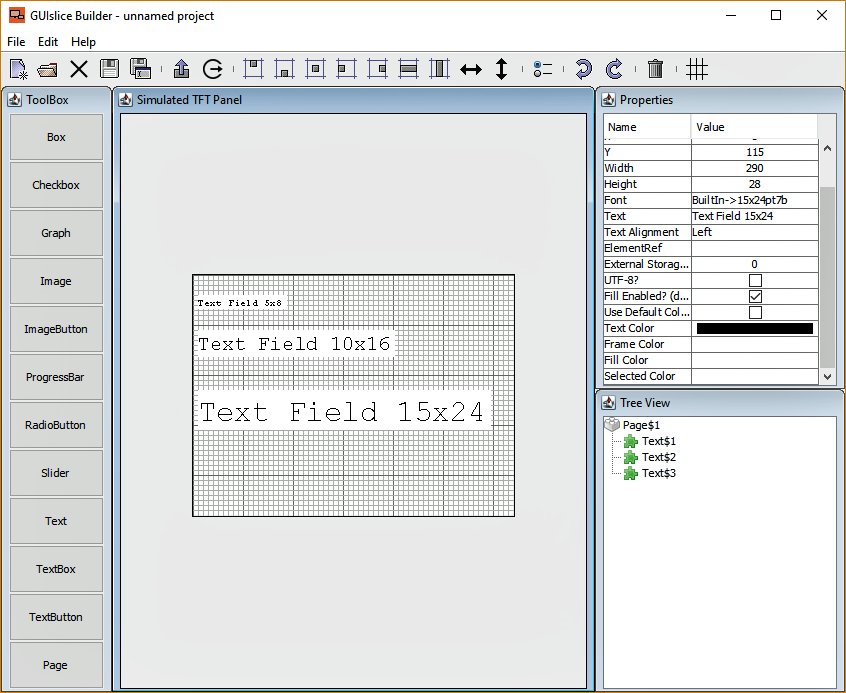

-----------------------------------------------
<div style="page-break-after: always;"></div>

Now create a BOX the size of your display, change the colors to White for Frame, and Fill and check the 'Draw Funct' box in the Properties view. Select the Box in the Treeview and drag it just under the Page$1.  Save the project as AlignText.prj.

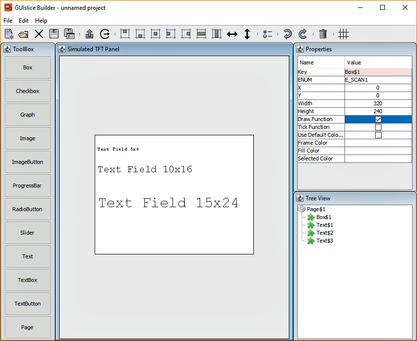

Generate the code and open your Arduino IDE selecting the new AlignText.ino file.  

Select OK and then add this line inside CbDrawScanner function under the 'add your drawing' comment.
```
  //TODO - Add your drawing graphic primitives
  drawGrid(rInside.w, rInside.h);
```

-----------------------------------------------
<div style="page-break-after: always;"></div>

Now before the CbDrawScanner function add this new function:
```
void drawGrid(int w, int h) {
  int x, y;
  int minor = 5;
  int major = 50;
  gslc_tsColor minorCol = GSLC_COL_GRAY;
  gslc_tsColor majorCol = GSLC_COL_BLACK;
  gslc_tsColor lineCol;
  
  // draw X axis
  for (x=0; x<w; x+=minor) {
    if (x%major == 0) {
      lineCol = majorCol;
    } else {
      lineCol = minorCol;
    }
    gslc_DrawLine(&m_gui, x, 0, x, h, lineCol);
    
  }
  // draw Y axis  
  for (y=0; y<h; y+=minor) {
    if (y%major==0) {
      lineCol = majorCol;
    } else {
      lineCol = minorCol;
    }
    gslc_DrawLine(&m_gui, 0, y, w, y, lineCol);
  }
}
```
Compile and download to your micro-controller.

Now go back to the builder. Delete the Box and you will see your text with grid lines. If Text isn't displaying the correct size in the Builder you need to adjust the DPI inside the Options->General tab. If the text is too large you need to reduce the DPI, while increasing DPI will increase the size of displayed text. The DPI has no effect on the target platform so don't re-generate the code, just keep adjusting the Builder's DPI until its a close enough match.

-----------------------------------------------
<div style="page-break-after: always;"></div>

# Appendix B - Font csv File Format

You can add or remove fonts from arduinofonts.csv or linuxfonts.csv files to support any font that exists on your target platform.
I would suggest that if you have more than a few fonts to add you should import the csv file into a spreadsheet, do your modifications, and export a new csv file.  That is how I created these files in the first place.  I used LibreOffice Calc for my spreadsheets.

The files are in CSV Format with a column header line - See RFC 4180.  Using a '\#' character to comment out lines is an unsupported extension to this RFC.

Column Titles:

1.  DisplayName - refers to the actual font on the target platform, Ex: 'FreeSans12pt7b'.
2.  IncludeFile - on the arduino platform it points to where to find a font, ex: 'Fonts/FreeSansBold12pt7b.h' or NULL
3.  DefineFile - on linux platform it points to the font, Ex: '/usr/share/fonts/truetype/droid/DroidSans.ttf'
4.  nFontId - GUIslice API parameter ENUM ID to use when referencing this font, Ex: E_FONT_TXT
5.  eFontRefType - GUIslice API parameter Font reference type (eg. filename or pointer)
6.  pvFontRef - GUIslice API parameter Reference pointer to identify the font. In the case of SDL mode, it is a filepath to the font file. In the case of Arduino it is a pointer value to the font bitmap array (GFXFont)
7.  nFontSz - GUIslice API parameter Typeface size to use. For Arduino built-in fonts a number from 1 to 5, AdaFruit's freefonts its always a 1, while in SDL mode its actual size of font.
8.  LogicalFont - the name java needs to use when accessing this font.
9.  LogicalFontSize - the pre-scaling size to display in the builder.
10. LogicalFontStyle - the font style, plain, bold, italic, bold+italic

Java ships with five platform independent fonts: Dialog, DialogInput, SansSerif, Serif, and Monospaced.  I have chosen to use Monospaced to represent Adafruit's built-in fonts which are 5x8 and plain only.
Adafruit GFX only scales them up from 1 to N. As an example scale of 2 gives you a character 10x16.
I have supported scales of 1 to 5.  You can edit this as you desire.

One thing you should keep in mind is that non built-in fonts take up a fair amount of memory so you should limit your selection to one or two non built-in fonts if your target platform is an Arduino.  

Use '\#' to comment out any you don't want to expose or simply delete them.

WARNING! No error checking exists in the code so be very careful with any edits.
If the Builder crashes after editing this file you can delete or rename it and a new file will be created with the original content when you next start the Builder.
